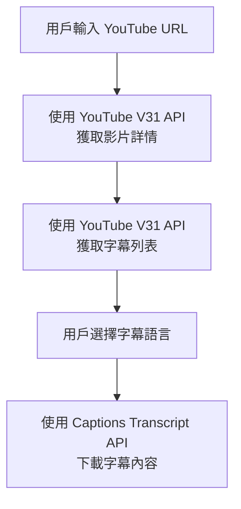

# YouTube API 使用策略

## 概述
本專案使用兩個 RapidAPI 服務來優化 API 調用次數和成本：

### 1. YouTube V31 API (主要使用)
- **用途**: 獲取影片詳細資訊和字幕列表
- **優點**: 
  - 穩定可靠（官方 YouTube Data API v3 標準格式）
  - 資料完整（包含觀看次數、發布日期、統計資訊等）
  - 免費配額較高
- **端點**:
  - 影片詳情: `GET /videos?part=snippet,statistics,contentDetails&id={videoId}`
  - 字幕列表: `GET /captions?part=snippet&videoId={videoId}`
- **Host**: `youtube-v31.p.rapidapi.com`

### 2. YouTube Captions Transcript API (輔助使用)
- **用途**: 下載字幕內容
- **限制**: 有調用次數限制
- **端點**:
  - 字幕內容: `GET /get-video-info/{videoId}?format=json&lang={lang}`
- **Host**: `youtube-captions-transcript-subtitles-video-combiner.p.rapidapi.com`

## 使用流程



## 優化策略

### ✅ 優點
1. **節省有限制的 API 調用**: 字幕列表使用免費的 YouTube V31 API
2. **資料更完整**: YouTube V31 提供更多影片統計資訊
3. **更好的字幕分類**: 
   - 可識別 CC 字幕 (`isCC`)
   - 可識別自動生成字幕 (`trackKind === 'asr'`)
   - 提供字幕名稱 (`name`)

### 📊 API 調用次數對比

#### 之前（全部使用 Captions Transcript API）
- 獲取影片資訊: 1 次
- 獲取字幕列表: 1 次
- 下載字幕內容: 1 次
- **總計**: 3 次有限制的 API 調用

#### 現在（混合使用）
- 獲取影片資訊: 1 次（YouTube V31，免費）
- 獲取字幕列表: 1 次（YouTube V31，免費）
- 下載字幕內容: 1 次（Captions Transcript，有限制）
- **總計**: 僅 1 次有限制的 API 調用 ⚡

## 字幕類型識別

### CC 字幕 (isCC: true)
- 圖示: 🔵 藍色字幕圖標
- 說明: 隱藏式字幕（Closed Caption）
- 特點: 包含音效描述、說話者標記等輔助資訊

### 自動生成字幕 (trackKind: 'asr')
- 圖示: ✨ 紫色星星
- 說明: YouTube 自動語音識別生成
- 特點: 可能有識別錯誤

### 作者上傳字幕
- 圖示: ✅ 綠色勾選
- 說明: 影片作者或頻道管理員上傳
- 特點: 準確度最高

## 實作細節

### API 文件
- `api/getVideoInfo.ts`: 使用 YouTube V31 API
- `api/getCaptions.ts`: 
  - 列表獲取: YouTube V31 API
  - 內容下載: Captions Transcript API

### 資料結構
```typescript
interface CaptionTrack {
  lang: string;           // 語言名稱（如 "英文 (自動生成)"）
  code: string;           // 語言代碼（如 "en"）
  url: string;            // 字幕 URL（YouTube V31 不提供）
  isAutoGenerated: boolean; // 是否為自動生成
  isCC?: boolean;         // 是否為 CC 字幕
}
```

## 環境變數
```env
RAPIDAPI_KEY=your_rapidapi_key_here
```

## 注意事項
1. YouTube V31 API 無法直接下載字幕內容，只能列出字幕
2. 因此字幕內容下載仍需使用 Captions Transcript API
3. 此策略有效節省了有限制的 API 調用次數（從 3 次減少到 1 次）

